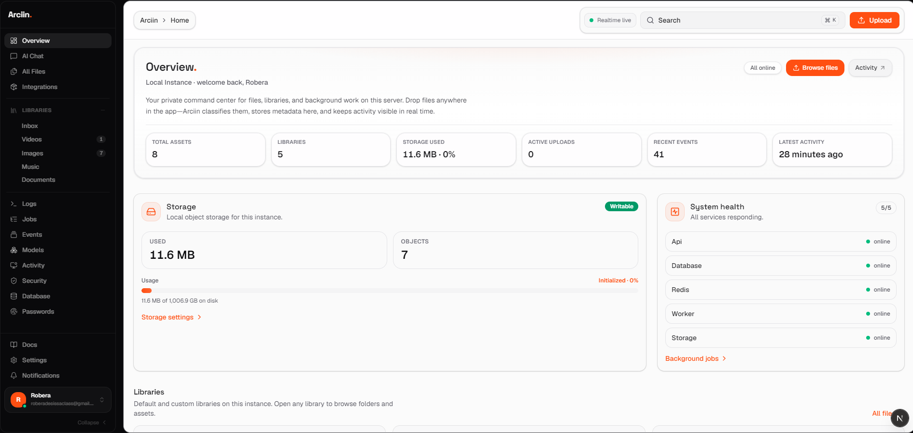
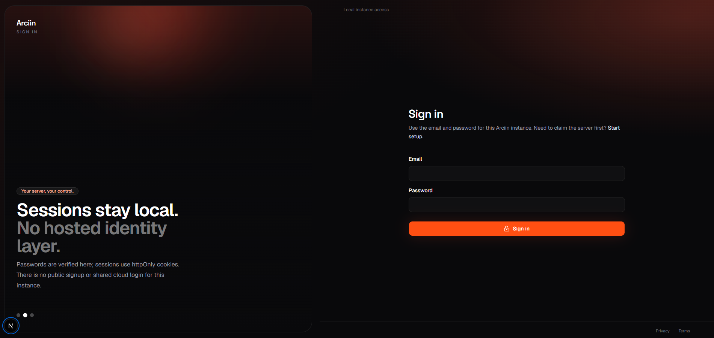

# Arciin

**Your server, your control.**

Arciin is a self-hosted private file, library, and media management platform. Run it on your own machine — organize videos, images, music, and documents into libraries, upload from the browser or scripts, and watch activity update in real time. No cloud account required.

<p align="center">
  
  <br />
  <em>Dashboard — libraries, storage overview, uploads, and live activity.</em>
</p>

<p align="center">
  
  <br />
  <em>First visit — claim the instance with your setup token and create the owner account.</em>
</p>

---

## Table of contents

- [What you get](#what-you-get)
- [Prerequisites](#prerequisites)
- [Quick start](#quick-start)
- [Managing Arciin](#managing-arciin)
- [Development](#development)
- [Environment variables](#environment-variables)
- [Python & API examples](#python--api-examples)
- [Docker](#docker)
- [Project layout](#project-layout)
- [Documentation](#documentation)

---

## What you get

| Area | Description |
|------|-------------|
| **First-run setup** | One-time instance claim with `ARCIIN_SETUP_TOKEN`, then local admin login |
| **Libraries** | Videos, Images, Music, Documents, and Inbox — with folders inside each |
| **Uploads** | Drag-and-drop anywhere in the app, upload queue, and multipart API for scripts |
| **Realtime** | Socket.IO events for uploads, assets, jobs, and activity |
| **Notifications** | In-app inbox, sounds, and badges when uploads complete |
| **Developer tools** | API keys, webhooks, Python examples in `scripts/examples/` |
| **Ops** | Logs page, jobs monitor, storage settings, optional Plex/Jellyfin guides |

---

## Prerequisites

Pick **one** install path:

| Path | You need on the host |
|------|----------------------|
| **Docker** (recommended for most installs) | [Docker](https://docs.docker.com/engine/install/) + Compose plugin |
| **Native** (`./install.sh`) | Linux/WSL2, Node 20+, pnpm, PostgreSQL 14+, Redis 6+, FFmpeg |

---

## Quick start

### 1. Clone

```bash
git clone https://github.com/Roberadesissaii-arc/arciin.git
cd arciin
```

### 2. Install

**Docker** (Ubuntu Server, NAS, home lab, or when native apt fails):

```bash
chmod +x scripts/docker-setup.sh install.sh
./install.sh --docker
# or: ./scripts/docker-setup.sh
```

You will choose (or set) **`ARCIIN_HOST_DATA_DIR`** — the real folder on your SSD/HDD where files are stored. See [`docs/DOCKER.md`](./docs/DOCKER.md).

**Native** (PM2 on the host — Arceserver-style servers):

```bash
chmod +x install.sh
./install.sh
```

Optional flags:

```bash
ARCIIN_UPGRADE_SYSTEM=1 ./install.sh   # also apt-install missing system packages
ARCIIN_SKIP_DB_INIT=1  ./install.sh    # skip migrate + seed
ARCIIN_SKIP_SYSTEM_PACKAGES=1 ./install.sh   # skip apt (deps already installed)
```

### 3. Configure `.env`

Review the generated `.env`. Key values:

| Variable | What to set |
|----------|-------------|
| `ARCIIN_SETUP_TOKEN` | Required on the setup screen |
| `SESSION_SECRET` | Change in production — `openssl rand -hex 32` |
| `DATABASE_URL` | Your PostgreSQL connection string |
| `REDIS_URL` | Your Redis URL |
| `ARCIIN_PUBLIC_URL` | Browser-facing URL, e.g. `http://192.168.1.10:3004` |

### 4. Start

```bash
bash scripts/start.sh
```

Or using PM2 directly:

```bash
pm2 start ecosystem.config.cjs
```

| Service | Default URL |
|---------|-------------|
| Web UI | http://localhost:3004 |
| API | http://localhost:4001/api |
| Health | http://localhost:4001/api/health |

### 5. Claim your instance

1. Open `http://<your-server-ip>:3004`
2. Enter the setup token from `.env` (`ARCIIN_SETUP_TOKEN`)
3. Fill in instance name, admin email, password, and storage path
4. Check **I have read and agree** — the Claim button activates
5. Sign in and explore the dashboard

---

## Managing Arciin

### Start and stop

```bash
bash scripts/start.sh     # Start all processes
bash scripts/stop.sh      # Stop all processes
```

### PM2 commands

```bash
pm2 status                # Process list — web, api, worker
pm2 logs arciin-web       # Live web logs
pm2 logs arciin-api       # Live API logs
pm2 logs arciin-worker    # Live worker logs
pm2 restart all           # Restart everything (required after .env changes)
pm2 restart arciin-api    # Restart API only
pm2 monit                 # CPU / memory dashboard
```

### Database

```bash
pnpm db:migrate    # Apply migrations (dev)
pnpm db:deploy     # Apply migrations (production)
pnpm db:seed       # Seed default libraries
pnpm db:studio     # Open Prisma Studio
```

### After updating (pull, build, restart)

When you change code on the server or pull a new release from git, run this from the project root (same directory as `install.sh`):

```bash
cd /path/to/arciin
git pull
pnpm install
pnpm exec prisma migrate deploy
pnpm build
pm2 restart arciin-api arciin-web arciin-worker
```

`pnpm build` compiles the web app, API, and worker. Restart all three PM2 processes so they load the new build.

Shortcut (web rebuild + PM2 restart):

```bash
pnpm deploy
```

If `arciin-web` shows **errored** and logs say *Could not find a production build in the '.next' directory*, you skipped `pnpm build` — run the full block above, not only `pm2 restart all`.

If you only changed environment variables (`.env`), a restart is enough:

```bash
pm2 restart arciin-api arciin-web arciin-worker
```

Check status and logs:

```bash
pm2 status
pm2 logs arciin-api --lines 50
```

---

## Development

```bash
pnpm install
pnpm db:generate
pnpm dev              # web + api + worker together
```

Run processes separately:

```bash
pnpm dev:web      # Next.js on :3000
pnpm dev:api      # Fastify on :4000
pnpm dev:worker   # BullMQ consumer
```

Quality checks (same as CI):

```bash
pnpm lint
pnpm typecheck
pnpm check        # lint + typecheck + build
```

### WSL: Python on Windows, Arciin in WSL

```bash
bash scripts/examples/arciin_wsl_hosts.sh
```

Set `API_BASE` in `scripts/examples/arciin_example_client.py` to the printed WSL IP.

---

## Environment variables

| Variable | Purpose |
|----------|---------|
| `DATABASE_URL` | PostgreSQL connection string |
| `REDIS_URL` | Redis for queues and realtime |
| `ARCIIN_DATA_DIR` | On-disk storage root (default `/srv/arciin-storage/arciin`, outside the repo) |
| `ARCIIN_SETUP_TOKEN` | Secret for first-run setup only |
| `ARCIIN_PUBLIC_URL` | Browser-facing URL |
| `ARCIIN_API_URL` | API origin for server-side use |
| `SESSION_SECRET` | Session signing key (32+ chars in production) |
| `NEXT_PUBLIC_API_BASE_URL` | Usually `/api` (proxied to Fastify) |
| `NEXT_PUBLIC_ARCIIN_API_ORIGIN` | Direct API URL for large uploads in dev |
| `NEXT_PUBLIC_SOCKET_URL` | Leave empty in local dev so cookies work |
| `PORT` | Web port (default 3004) |
| `API_PORT` | API port (default 4001) |
| `MAX_UPLOAD_SIZE_MB` | Max upload size (web proxy + API; default 10240) |
| `UPLOAD_RATE_LIMIT_PER_MINUTE` | Per-user upload cap per minute (default 500; was 60) |
| `LOG_MAX_FILE_BYTES` | Max size per log file before oldest lines are dropped (default 1800000) |

See `.env.example` for the full list.

---

## Python & API examples

Runnable scripts live in **`scripts/examples/`**. Set shared config once in `arciin_example_client.py`.

```bash
pip install requests
# Socket.IO: pip install "python-socketio[client]" websocket-client
```

| Script | What it does |
|--------|-------------|
| `health_check_example.py` | Ping API health |
| `list_libraries_example.py` | List libraries and IDs |
| `create_folder_example.py` | Create a folder |
| `upload_image_example.py` | Upload to Images library |
| `upload_video_example.py` | Upload to Videos library |
| `socket_events_example.py` | Listen for live events |

Create API keys in the app: **Developer → API Keys**.

---

## Docker

Full guide: **[`docs/DOCKER.md`](./docs/DOCKER.md)** (storage bind mounts, any Linux host, troubleshooting).

```bash
./scripts/docker-setup.sh
# Interactive: picks SSD path, writes .env, runs compose
```

Or manually:

```bash
cp .env.docker.example .env
# Set ARCIIN_HOST_DATA_DIR=/mnt/your-ssd/arciin-data
# Set ARCIIN_SETUP_TOKEN, SESSION_SECRET, ARCIIN_PUBLIC_URL

export ARCIIN_HOST_DATA_DIR=/mnt/your-ssd/arciin-data
docker compose up --build -d
```

Open **http://localhost** (Caddy on port 80). Your files live on disk at **`ARCIIN_HOST_DATA_DIR`**, not inside the container.

Caddy reverse proxy: `docker/caddy/Caddyfile`. Images: `Dockerfile.web`, `Dockerfile.api`, `Dockerfile.worker`.

---

## Project layout

```text
arciin/
├── app/                    # Next.js App Router (UI)
├── apps/
│   ├── api/                # Fastify REST + Socket.IO
│   └── worker/             # BullMQ jobs (thumbnails, metadata)
├── components/             # React UI components
├── packages/
│   ├── database/           # Prisma client wrapper
│   └── shared/             # shared types and constants
├── prisma/                 # schema and migrations
├── scripts/
│   ├── examples/           # Python integration examples
│   ├── start.sh            # start all PM2 processes
│   └── stop.sh             # stop all PM2 processes
├── docker/                 # Caddy config and helpers
├── docker-compose.yml
└── install.sh              # first-time setup script
```

---

## Tech stack

**Frontend:** Next.js 16, React 19, TypeScript, Tailwind CSS v4, shadcn/ui, TanStack Query, Zustand, Socket.IO client

**Backend:** Fastify, Prisma, PostgreSQL, Redis, BullMQ, Socket.IO, Sharp, FFmpeg

---

## Documentation

| Doc | Contents |
|-----|----------|
| [`docs/DEVELOPMENT.md`](./docs/DEVELOPMENT.md) | Day-to-day dev workflow |
| [`docs/DOCKER.md`](./docs/DOCKER.md) | Docker on any Linux host, SSD bind mounts |
| [`docs/DEPLOYMENT.md`](./docs/DEPLOYMENT.md) | Production and self-hosting |
| [`docs/ARCHITECTURE.md`](./docs/ARCHITECTURE.md) | System design |
| [`docs/API.md`](./docs/API.md) | API overview |
| In-app **Documentation** | Full REST manual at `/docs` when running |

Also see [`AGENTS.md`](./AGENTS.md) for contributor conventions.

---

## License

Private / project-specific — see repository settings for license terms if published.

---

<p align="center">
  <strong>Arciin</strong> — built for the server you own.
</p>
